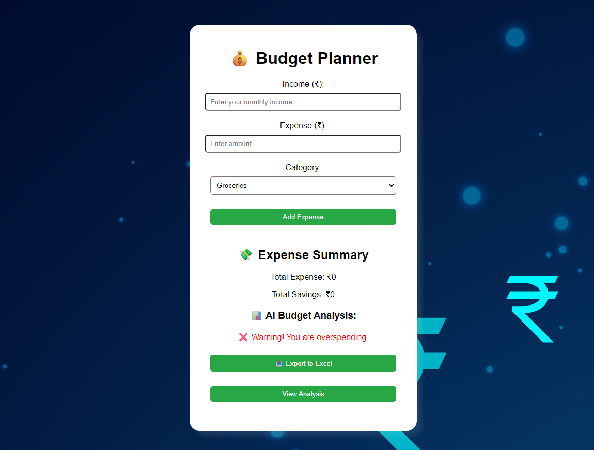
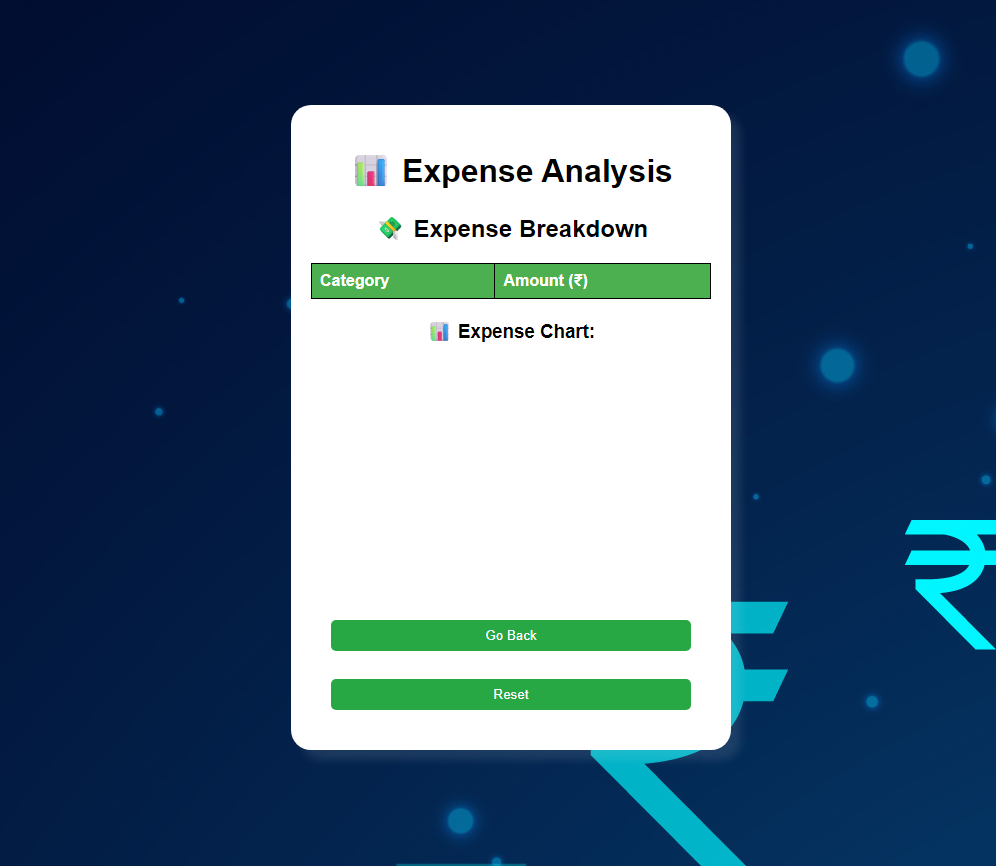

# 💸 Budget Planner

**Budget Planner** is a simple, responsive web app that helps users track income and expenses with real-time budget analysis and visual charts. Built with vanilla JavaScript, it uses `localStorage` to persist data and allows exporting your budget as an Excel report.

---

## 🚀 Features

- ✅ Add income and categorized expenses
- 📈 View budget analysis with savings tips
- 🧠 Get automatic spending warnings
- 📊 Interactive pie chart of expenses
- 💾 Data saved locally (no backend needed)
- 📤 Export data to Excel (.xlsx)

---

## 🖥️ Demo

[Click here to view the live site](https://shrijan18.github.io/Budget-Planner/)

---

## 📸 Screenshots

  
  

---

## 📂 Project Structure

<pre>
Budget-Planner/
├── images/             # Contains screenshots or assets used in the project
├── analysis.html       # Expense breakdown & pie chart
├── index.html          # Main input UI
├── README.md           # Project documentation and usage instructions
├── script.js           # All functionality (budget logic, charts, export)
└── styles.css          # Layout and responsive styles
</pre>

---

## 🛠️ Tech Stack

- HTML, CSS, JavaScript
- [Chart.js](https://www.chartjs.org/) for pie chart
- [SheetJS (xlsx.js)](https://sheetjs.com/) for Excel export
- Browser `localStorage` for saving data

---

## 📦 Getting Started

1. **Clone the repo**:
   ```bash
   git clone https://github.com/Shrijan18/Budget-Planner.git

2. Open index.html in your browser:
    - No setup needed — it's a static front-end project.

3. (Optional) Serve with local server:

    ```bash
    # Using Python
    python -m http.server
Open http://localhost:8000 to run locally.

---

## 📤 Export to Excel

Click the "Export to Excel" button on the analysis page to download your data in .xlsx format. The file includes a table of categories and their expense totals.

---

## 🧠 Future Improvements

- Add date-wise tracking

- Multi-user or login support

- Dark mode UI

---

## 📜 License

This project is licensed under the MIT License.